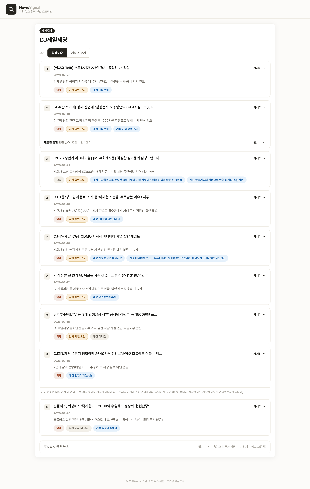
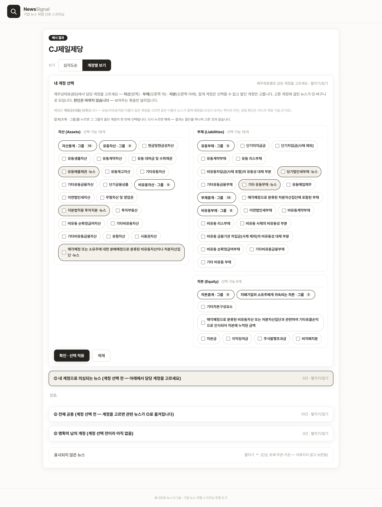

# 기업 위험 뉴스 모니터링 (News to Signal)

🇰🇷 한국어

**회사 이름 하나만 넣으면, 그 회사의 최근 뉴스에서 재무·감사 위험 신호를 찾아,
심각도순으로 정리하고 담당 계정별로 매핑해 근거와 함께 보여주는 도구입니다.
— 판정은 감사인이 합니다.**

## ▶️ 데모 영상

말보다 1분 영상이 빠릅니다. 실제로 어떻게 쓰는지 먼저 보세요.

▶️ **[데모 영상 링크]**

## 이런 도구입니다

감사인은 담당 회사에 무슨 일이 벌어지는지 외부 뉴스로 살펴야 합니다. 그런데
뉴스는 두 가지 문제가 있습니다.

- **너무 많습니다** — 하루에도 수십 건, 대부분은 홍보나 단순 동향입니다.
- **중요한 게 묻힙니다** — 워크아웃·우발채무·특수관계자 거래 같은 진짜 신호가
  광고성 기사 사이에 파묻힙니다.

그래서 감사인이 기사를 하나하나 훑어도, 정작 재무제표에 닿는 신호를 골라내기가
어렵습니다. 기존 뉴스 알림은 "키워드가 들어간 기사"를 던져줄 뿐, 그게 어느
계정에 영향을 주는지, 얼마나 심각한지는 말해주지 않습니다.

이 도구는 그 일을 **네 단계**로 대신합니다.

1. 회사 이름으로 최근 1년치 뉴스를 **넓게, 중립적으로 수집하고**
2. 각 뉴스가 재무·감사에 닿는 신호인지 **뜻을 이해해 판단하고**
3. **심각도순으로 정렬해** 급한 것부터 위로 올리고
4. 각 뉴스를 **담당 계정에 매핑하고 근거 문장과 함께** 보여 줍니다.

회사명 하나 넣고 기다리면, 흩어진 뉴스에서 챙겨야 할 신호만 추려 한자리에
정리해 줍니다.

## 누구에게·왜 필요한가

**이런 분들을 위해 만들었습니다 — 회계법인 감사팀.**
감사계획을 세울 때, 새 고객을 맡을지 검토할 때, 이미 맡은 회사를 계속 지켜볼 때
쓰는 도구입니다.

**감사인이 실제로 겪는 어려움**

- 뉴스가 **너무 많고 대부분 무관해서**, 중요한 위험 신호를 직접 골라내기 어렵습니다.
- 진짜 중요한 신호가 **홍보성 기사에 묻혀**, 훑어봐도 놓치기 쉽습니다.

**이 도구가 해결하는 방식**
뉴스를 넓게 모은 뒤, 재무·감사에 닿는 신호만 골라 **심각도순으로 정렬**하고,
각 신호를 **담당 계정에 연결**해 정리해 줍니다. 판단마다 근거 문장이 붙어,
감사인은 정리된 결과를 보고 스스로 판정합니다.

**이렇게 활용합니다**

- **감사계획 전** — 회사와 산업의 최근 이슈를 미리 파악
- **위험 평가** — 외부에서 관측되는 위험 신호를 빠르게 조사
- **계속감사 모니터링** — 맡고 있는 회사에 무슨 일이 생겼는지 후속 추적

## 이렇게 나옵니다

회사명 하나를 넣으면 아래처럼 나옵니다.

*결과 화면 — 위험 신호를 심각도순으로 정렬. 각 카드에 악재/호재·담당 계정 표시.*

*근거 확인 — 왜 악재인지, 왜 이 계정인지, 원문 근거 문장을 펼쳐 확인.*

*계정별 보기 — 재무상태표 표에서 담당 계정을 고르면 그 계정에 걸린 뉴스가 모임.*

## 무엇을 따져서 정렬하나

같은 악재라도 감사인에게 급한 정도는 다릅니다. 각 뉴스를 아래 관점에서 따져
심각도를 매기되, 점수 공식으로 굳히지 않고 "무엇을 먼저 물어야 하는가"의
질문으로만 씁니다.

| 관점 | 무엇을 보나 |
|---|---|
| 관련성 | 정말 이 회사의 일인가 |
| 규모 | 회사 재무 대비 얼마나 큰가 |
| 확실성 | 확정된 사실인가 가능성인가 |
| 시점 | 지난 일인가 진행 중인가 |
| 방향 | 위험이 커지는가 해소되는가 |

## 실행 방법

필요한 것: **Python 3**, 그리고 **API 키 4개**(아래 발급처 참고).
(최초 1회) pip install -r requirements.txt
start_news_risk_monitor.bat 더블클릭 ← Windows
./start_news_risk_monitor.sh ← macOS / Linux
브라우저가 http://127.0.0.1:8765 을 자동으로 엽니다
화면에서 API 키 4개 입력 → 회사명 입력 → 결과 확인

> **이 도구는 내 PC에서 돌아갑니다.** 실행 파일을 더블클릭하면 창이 하나 열리고
> 잠시 뒤 브라우저가 자동으로 열립니다. **쓰는 동안 이 실행 창을 닫지 마세요 —
> 이 창이 서버를 유지합니다.** 다 쓴 뒤 창을 닫으면 서버가 꺼집니다.

**API 키 4개가 필요합니다.** Open DART와 네이버 검색 API는 **무료**로 발급받고,
Anthropic(Claude) API는 쓴 만큼 내는 **유료**라 소액의 크레딧이 필요합니다.

| 키 | 발급처 |
|---|---|
| `OPENDART_API_KEY` | https://opendart.fss.or.kr (오픈다트 인증키) |
| `ANTHROPIC_API_KEY` | https://console.anthropic.com |
| `NAVER_CLIENT_ID` / `NAVER_CLIENT_SECRET` | https://developers.naver.com (검색 API 등록) |

> 키는 **화면에서 입력**하며, 이 PC의 메모리에만 잠깐 머물다 서버를 끄면
> 사라집니다. 파일이나 기록에 저장하지 않고, 내 PC 안에서만 돌아 밖으로 나가지
> 않습니다. (키 이름만 담긴 `.env.example`을 참고하세요.)

직접 돌리지 않아도, 미리 실행해 둔 예시 결과를 저장소의 `out/results/` 폴더에서
바로 볼 수 있습니다.

## 이 도구가 신경 쓴 것

만들면서 특히 공들인 네 가지입니다.

**1. 키워드가 아니라 뜻을 이해해 판단합니다.**
"횡령·소송" 같은 부정 단어 목록으로 위험을 잡으면, 목록에 없는 새 유형은 놓치고
업종마다 다른 위험의 언어를 담을 수 없습니다. 이 도구는 뉴스를 넓게 모은 뒤,
각 기사가 재무·감사에 닿는 신호인지 **뜻을 이해해서** 판단합니다. 고정된
키워드·점수표를 쓰지 않습니다.

**2. 억지로 채우지 않고, 없으면 없다고 합니다.**
화면에는 위험 신호만 올리고, 단순 호재·무관 기사는 **삭제하지 않고 접어서**
보존합니다. 몇 건을 모아 몇 건을 보여주는지 화면에 밝혀, 무엇이 걸러졌는지
감사인이 확인할 수 있습니다.

**3. 판단의 근거를 함께 붙여, 감사인이 스스로 확인할 수 있습니다.**
각 판단 아래에 그 판단이 근거한 **기사 원문 문장**이 붙습니다. 왜 악재인지, 왜
이 계정에 닿는지마다 실제 문장이 달려 있어, 기사 전문을 열지 않아도 근거만으로
추론이 타당한지 바로 판단할 수 있습니다. 근거가 없는 판단은 화면에 올리지
않으며, 최종 판정은 언제나 감사인의 몫입니다.

**4. 특정 회사가 아니라 어느 상장사든 동작합니다.**
특정 회사에 맞춘 값을 미리 넣어두지 않았습니다. 회사 이름만 넣으면 어느
상장사든 같은 방식으로 처리합니다. (건설·조선·반도체·자동차·식품 등 여러
업종에서 확인.)

---
_규모는 뉴스에 금액이 명확할 때만 회사 재무 대비 비율로 계산하고, 모호하면
"규모 미상"으로 남깁니다. 계정 정보는 DART 표준재무제표 기준입니다. 교육·리서치
목적의 로컬 실행 도구입니다._
